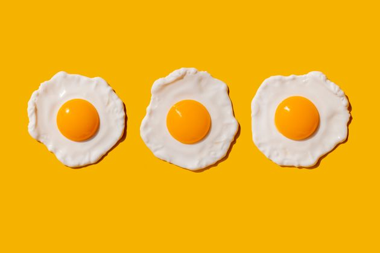
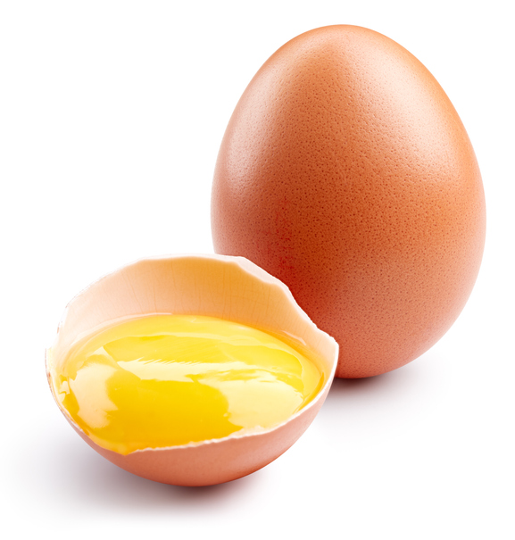
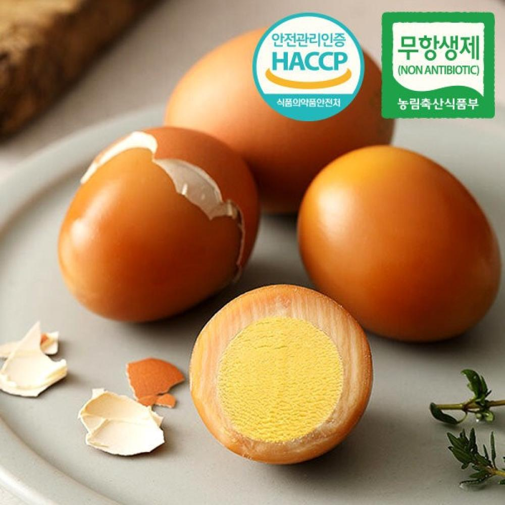
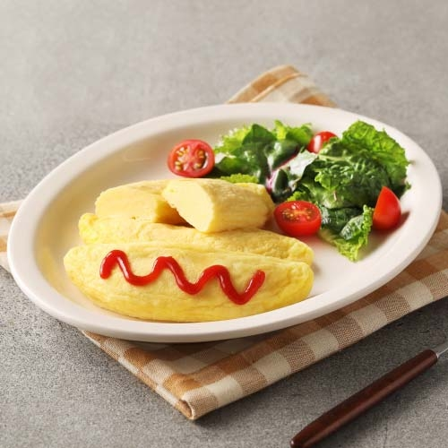
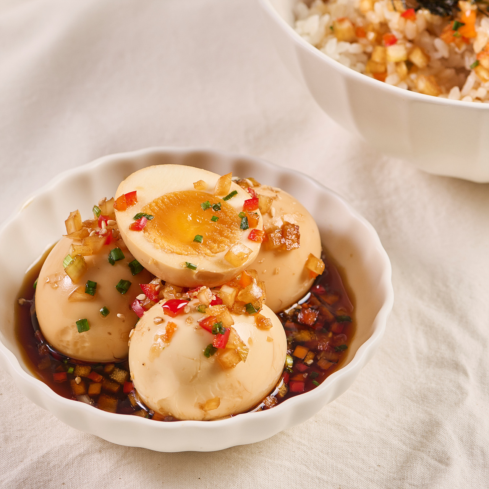

<!DOCTYPE html>
<html lang="en">
<head>
    <meta charset="UTF-8">
    <meta name="viewport" content="width=device-width, initial-scale=1.0">
    <title>후라이의 꿈 - 건강한 식품의 시작</title>
    <link rel="stylesheet" href="styles.css">
    
    
</head>
<body>
    <header>
        

            <h1>🍳 후라이의 꿈 🍳</h1>
            
건강한 식품의 시작, 함께 해요!

        

        <nav>
            <ul>
                <li><a href="#about">후라이의 꿈을 소개합니다!</a></li>
                <li><a href="#products">제품 소개</a></li>
                <li><a href="#contact">문의하기</a></li>
            </ul>
        </nav>
        

            <input type="text" placeholder="ID" id="id">
            <input type="password" placeholder="Password" id="password">
            <button>로그인</button>
        

    </header>
    <main>
        <section id="about">
            

            <h2>후라이의 꿈을 소개합니다!</h2>
            
            
<strong>후라이의 꿈</strong>은 2015년에 설립된 친환경 식품 회사로, 국내산 동물복지 계란을 중심으로 다양한 제품을 선보이고 있어요.  
            🌱 <strong>비전:</strong> 지속 가능한 농업과 건강한 식생활을 통한 행복한 사회를 만들어요! 
            🏆 <strong>성과:</strong> 지난 8년간 동물복지 인증을 유지하며 소비자 만족도 98%를 달성했답니다. ✨

        </section>
        <section style="text-align: center;">
            

            <h2>제품 소개</h2>
        </section>
        <section id="products">
            

                
                <h3>달빛닮은 동물복지 계란</h3>
                
가격: 8,000원 (12개입) 항생제를 사용하지 않고 동물복지 기준을 준수하며 생산한 신선한 계란입니다.

                <button class="buy-button" onclick="confirmPurchase('달빛닮은 동물복지 계란')">구매하기</button>
            

            

                
                <h3>달빛에 구운란</h3>
                
가격: 10,000원 (10개입) 동물복지 계란으로 만들어진 맛있는 구운 계란. 간편하게 즐길 수 있는 건강 간식입니다.

                <button class="buy-button" onclick="confirmPurchase('달빛에 구운란')">구매하기</button>
            

            

                
                <h3>특별한 오믈렛</h3>
                
가격: 12,000원 (5개입) 달걀의 부드러움을 살린 고급 오믈렛 제품으로, 프리미엄 재료만을 사용하여 만들었습니다.

                <button class="buy-button" onclick="confirmPurchase('특별한 오믈렛')">구매하기</button>
            

            

                
                <h3>일본식 아지타마고</h3>
                
가격: 9,000원 (6개입) 국내산 동물복지 계란으로 만든 고소하고 부드러운 일본식 아지타마고입니다. 🍜🥚

                <button class="buy-button" onclick="confirmPurchase('일본식 아지타마고')">구매하기</button>
            

        </section>
        <section style="text-align: center;" id="contact">
            

            <h2>문의하기</h2>
            <form action="https://formsubmit.co/your-email" method="POST">
                <label for="name">이름:</label>
                <input type="text" id="name" name="name" required>
                <label for="email">이메일:</label>
                <input type="email" id="email" name="email" required>
                <label for="message">문의 내용:</label>
                <textarea id="message" name="message" rows="4" required></textarea>
                <button type="submit">보내기</button>
            </form>
        </section>
    </main>
    <footer>
        
&copy; 2024 후라이의 꿈. 모든 권리 보유. 💖

    </footer>
</body>
</html>
